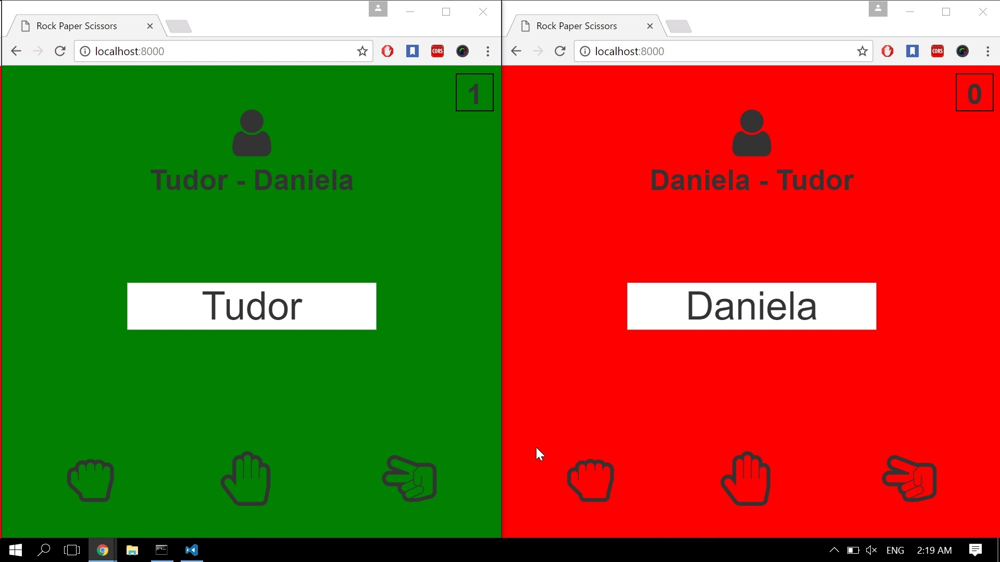

# Multiplayer-Game
A rock paper scissors multiplayer game made with NodeJS.

# Features
A very simple and nicely designed game built with web sockets.

# Technologies
* NodeJS - JavaScript backend/server-side solution of choice

* Express - Node framework that makes handling http requests with ease

* JsonWebToken - package that helps with generating JWTs for secure authentication

* Socket.io - web sockets implementation, fast and reliable real-time communication engine

* Angular - rich frontend web framework, helps creating fast, reliable web applications

* Angular-CLI - command line interface for streamlined angular development

* TypeScript - superset of JavaScript that can be compiler-checked, also has types!!

* Bootstrap - CSS/JS framework, makes it easy to develop responsive, well polished web apps

#How it works

Once you insert a username which is not being used the server is going to try to find you an oponent.

After finding an oponent you will be able to choose between "rock", "paper" and "scissors". The score is displayed on the right corner of the screen and you can also check out other's people score by clicking on the human icon in the upper part of the screen.

#Motivation

This is a personal project with the purpose of better understanding socket.io.